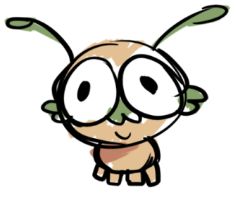

# 🚀 **Alien Game**

## 🌟 **Overview**
In this thrilling co-op game, players find themselves aboard a spaceship, tasked with completing objectives while avoiding an evil alien enemy roaming the ship. Work together to gather materials, build a weapon, and take down the alien!

---

## 📜 **Table of Contents**
- [Overview](#overview)
- [Gameplay Mechanics](#gameplay-mechanics)
- [Objectives](#tasks-objectives)
- [Key Features](#key-features)

---

## ⚙️ **Gameplay Mechanics**

### Dying and Clones
- 💀 **Death**: When a player is killed by the alien, a teammate must run to the **Room of Clones** to release their clone.
- 🔄 **Inventory Drop**: Player inventory drops at the death location, marked on the map.

---

## 🛠️ **Tasks (Objectives)**

### 1 Player Objectives

| **Objective**                   | **Description**                             |
|---------------------------------|---------------------------------------------|
| **Hacking Task**                |                                             |
| **Wires**                       | Arrange the wires to add the voltage to 46  |
| **Oxygen Fix Vent System**      | Re-arrange the vents to connect             |
| **Decode Alien Communication**  |                                             |
| **Alien Parts in Tubes**        | Stop them from escaping by completing puzzles |
| **Calibrate Ship's Weapon System** | Allow 2 player shooting down meteor task   |

### 2 Player Objectives

| **Objective**                                 | **Description**                                                                 |
|-----------------------------------------------|---------------------------------------------------------------------------------|
| **Fix Lighting System**                       | Open the electricity box and pull down the lever. Both players hold the lever to fix lights. |
| **Shoot Down the Approaching Meteor Shower**  | One player shoots meteors, the other repairs the ship.                          |

---

## 🚀 **Key Features**
- 👫 **Team-Based Gameplay**: Work together to complete objectives and stay alive.
- 👾 **Alien Threat**: Intelligent alien enemy adds tension and danger.
- 🧬 **Cloning System**: A second-chance mechanic with clone regeneration.
- 🧩 **Interactive Tasks**: A variety of engaging tasks and puzzles, requiring both individual effort and teamwork.

---

